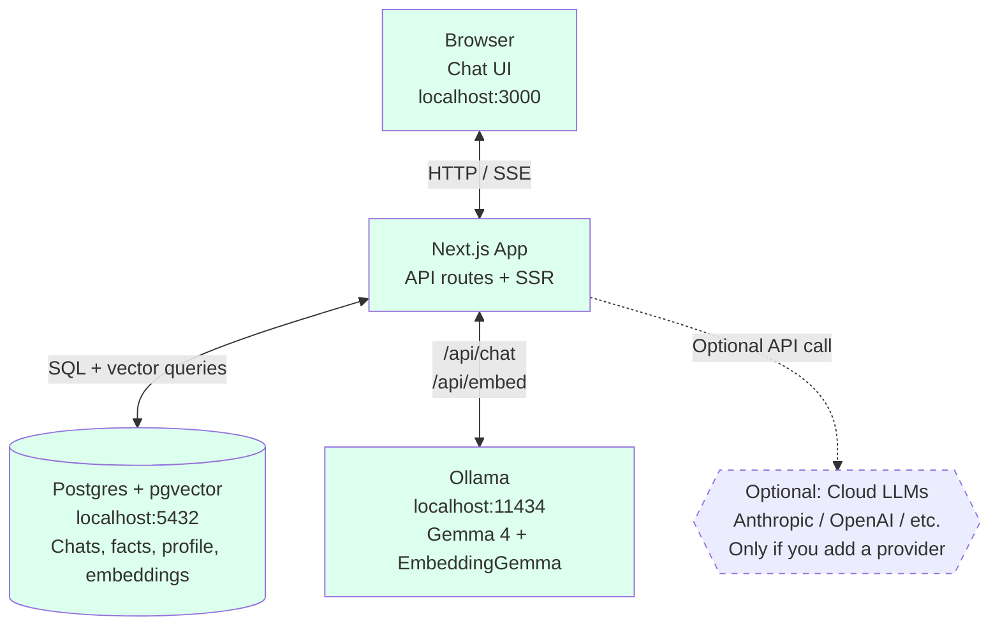
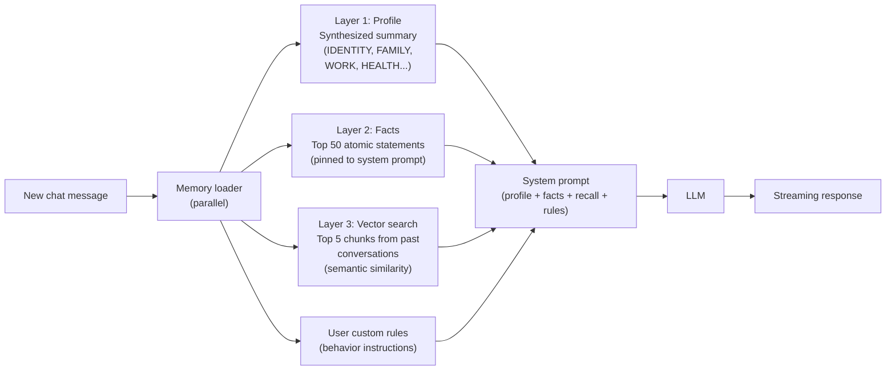
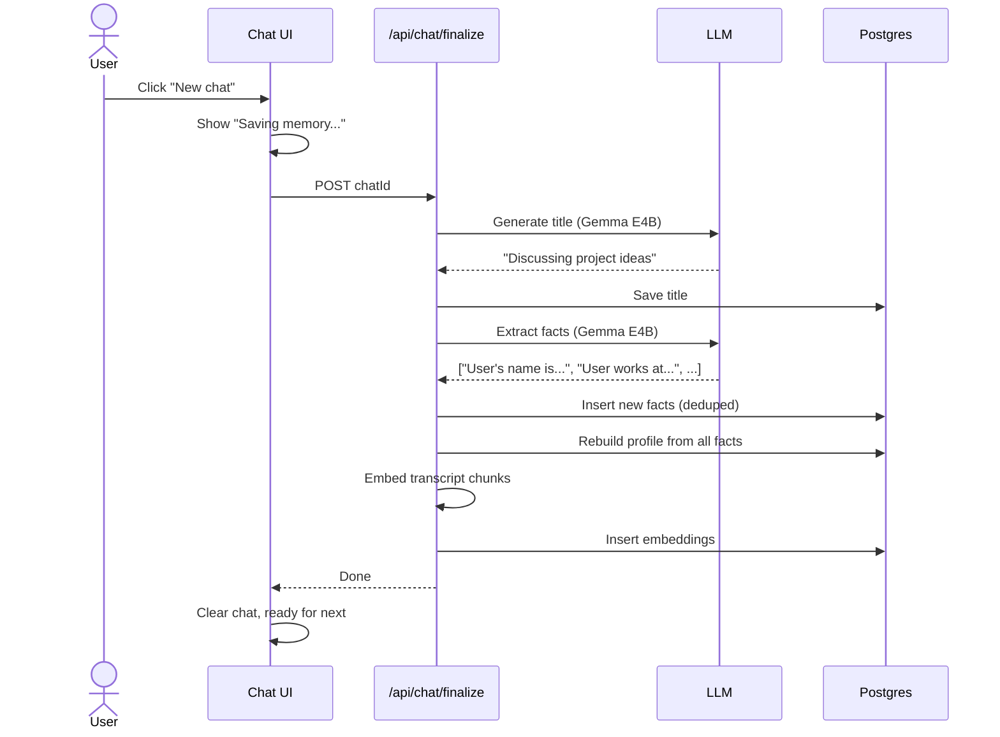
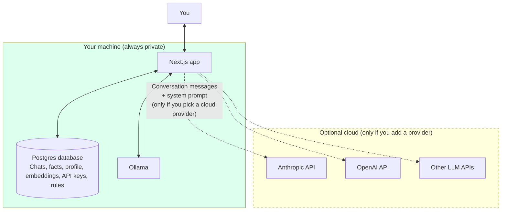

# RecallMEM

A private, local-first AI chatbot with persistent working memory. The AI actually remembers you across conversations -- not just within one chat. Runs entirely on your machine. Nothing leaves your computer unless you explicitly choose a cloud provider.

Think of it as ChatGPT or Claude.ai, except:

- No accounts. No cloud. No telemetry.
- The AI builds a profile of you over time and recalls things from past conversations.
- You can edit, delete, or wipe its memory at any time.
- You can plug in any LLM you want -- local Gemma 4 via Ollama, or cloud APIs (Claude, GPT, Groq, Together, etc.) with your own API key.
- Your conversations are stored in your own local Postgres database. They literally cannot leak because there is no remote server.

---

## Why RecallMEM exists

Most "local AI" tools are one of these:

1. **A chat UI for Ollama** -- looks pretty, has zero memory between conversations
2. **A memory library/SDK** -- powerful, but you need to build the whole UI yourself
3. **A cloud-based memory product** -- has the full feature set, but your data goes to their servers

There's a gap: **a complete personal AI companion app with real working memory that runs 100% locally.** RecallMEM fills that gap.

---

## What it can do

- **Persistent memory across all conversations** -- profile + facts + semantic recall
- **Auto-extracts facts** from your conversations (categorized into Identity, Family, Work, Health, etc.)
- **Auto-builds a profile** of who you are from those facts
- **Vector search over every past conversation** -- ask about something you discussed last month, the AI finds it
- **Custom rules / instructions** -- tell the AI how to talk to you ("don't gaslight me", "no preachy disclaimers", etc.)
- **Memory inspector** -- view, edit, or delete every fact the AI has learned
- **Wipe memory** with `VACUUM FULL + CHECKPOINT` so deleted data is unrecoverable at the database level
- **File uploads** -- drag and drop images, PDFs, code, text files into the chat
- **Multi-provider support** -- Ollama (local), Anthropic (Claude), OpenAI (GPT), or any OpenAI-compatible API
- **Test connection** for cloud providers before saving the API key
- **Chat history sidebar** with date grouping and pinned chats
- **Markdown rendering** in responses (headings, code blocks, tables, etc.)
- **Streaming responses** with auto-scroll

---

## How it works

### System architecture



Everything in the green boxes runs on **your machine**. The dashed cloud box only activates if you explicitly add a cloud provider in settings.

### The three-layer memory system



**Why three layers?**

- **Profile** loads instantly (one DB row), gives the AI the high-level "who am I talking to" baseline.
- **Facts** are atomic, queryable, editable. Stored as individual rows you can view/delete in the Memory page.
- **Vector search** finds semantically relevant prose from any past conversation. Catches the long tail that doesn't fit in structured facts.

Together they let the AI know your name, your family, your job, AND remember the specific legal argument you were workshopping three weeks ago.

### What happens when you end a chat



The next conversation immediately sees the new memory.

---

## Hardware requirements

The biggest variable is which LLM you choose. RecallMEM lets you pick.

### Fully open source (Ollama + Gemma 4 locally)

| Setup           | Model           | RAM needed | Speed         | Quality |
|-----------------|-----------------|------------|---------------|---------|
| Phone / iPad    | Gemma 4 E2B     | 8GB        | Fast          | Basic   |
| MacBook Air     | Gemma 4 E4B     | 16GB       | Fast          | Good    |
| Mac Mini M4     | Gemma 4 E4B     | 16GB       | Fast          | Good    |
| Mac Studio M2+  | Gemma 4 26B MoE | 32GB+      | Very fast     | Great   |
| Workstation     | Gemma 4 31B     | 32GB+      | Slower        | Best    |

The 26B MoE is the **recommended default** for any machine with 32GB or more. It only activates 3.8B parameters per token (Mixture of Experts) so it's much faster than the 31B Dense while still being ranked #6 globally on the Arena leaderboard.

### Using cloud providers (Claude / GPT / Groq / etc.)

If you don't want to run a local LLM, you can plug in any cloud provider's API:

| Setup            | RAM needed | Notes                                                       |
|------------------|------------|-------------------------------------------------------------|
| Any laptop       | ~4GB free  | Runs the Postgres + Node.js + browser. The LLM runs remotely. |

You bring your own API key. RecallMEM still keeps the database, memory, profile, and rules entirely on your machine -- only the chat messages get sent to the provider as part of the API call.

**Privacy tradeoff:** when you use a cloud provider, your conversation goes to that provider's servers. Your facts and profile get sent as part of the system prompt. This breaks the local-only guarantee for those specific conversations. Use Ollama for anything you want fully private.

---

## Installation

You need three things on your machine:

1. **Node.js 20+** -- the app runs on Next.js
2. **Postgres 17 + pgvector** -- the database with vector search
3. **Ollama** -- the local LLM runtime (skip if you only want cloud providers)

### macOS (Homebrew)

```bash
# 1. Install Node.js
brew install node

# 2. Install Postgres 17 + pgvector
brew install postgresql@17 pgvector
brew services start postgresql@17

# 3. Install Ollama (optional - skip if using cloud only)
brew install ollama
brew services start ollama

# 4. Pull the local models (optional)
ollama pull gemma4:26b          # ~18GB - main chat model
ollama pull gemma4:e4b          # ~4GB - fast model for background tasks
ollama pull embeddinggemma      # ~600MB - vector embeddings (REQUIRED)
```

### Linux

```bash
# 1. Node.js (use nvm or your distro's package manager)
curl -fsSL https://deb.nodesource.com/setup_20.x | sudo -E bash -
sudo apt install -y nodejs

# 2. Postgres + pgvector
sudo apt install postgresql-17 postgresql-17-pgvector
sudo systemctl start postgresql

# 3. Ollama
curl -fsSL https://ollama.com/install.sh | sh

# 4. Pull models
ollama pull gemma4:26b
ollama pull gemma4:e4b
ollama pull embeddinggemma
```

### Windows

Use WSL2 with Ubuntu and follow the Linux instructions. Postgres + pgvector + Ollama all work cleanly inside WSL2. Native Windows works too but is rougher around the edges.

---

## Setup

```bash
# 1. Clone the repo
git clone https://github.com/RealChrisSean/RecallMEM.git
cd RecallMEM

# 2. Install dependencies
npm install

# 3. Create the database
createdb recallmem

# 4. Run the schema migration
psql recallmem -f scripts/init-db.sql

# 5. Configure environment variables
cat > .env.local <<EOF
DATABASE_URL=postgres://$USER@localhost:5432/recallmem
OLLAMA_URL=http://localhost:11434
OLLAMA_CHAT_MODEL=gemma4:26b
OLLAMA_FAST_MODEL=gemma4:e4b
OLLAMA_EMBED_MODEL=embeddinggemma
EOF

# 6. Start the dev server
npm run dev
```

Open [http://localhost:3000](http://localhost:3000). You should see the chat UI.

If you don't want to run a local LLM at all, you can skip steps 4-6 of the install and just install `embeddinggemma` (the embedding model is required). Then add a cloud provider via the **Providers** page in the app.

---

## First steps

1. **Send a message.** Just chat normally. The AI starts with no memory.
2. **Tell it about yourself.** "My name is X, I work at Y, my wife's name is Z." It will remember these.
3. **Click "New chat"** when you're done. You'll see "Saving memory..." -- this is the AI extracting facts from the conversation.
4. **Start a fresh chat.** Ask "what's my name?" -- it should know.
5. **Open the Memory page** (link in the header). You'll see your profile and all the facts the AI has extracted, organized by category. You can edit or delete any of them.
6. **Open the Rules page.** Write standing instructions for how the AI should behave. Examples:
   - "Don't gaslight me. If I'm wrong, just say so."
   - "I have dyslexia, prefer plain prose over bullets."
   - "Don't add disclaimers like 'consult a professional' unless I ask."
7. **Open the Providers page** if you want to add Claude, GPT, or another API. Each provider has a Test Connection button so you can verify your key works before saving.

---

## Adding a cloud provider

1. Go to **Providers** in the chat header
2. Click **+ Add provider**
3. Pick a provider type:
   - **Anthropic** for Claude (Opus, Sonnet, Haiku)
   - **OpenAI** for GPT (GPT-5, GPT-4o, etc.)
   - **OpenAI-compatible** for Groq, Together, OpenRouter, LM Studio, vLLM, Mistral, etc.
4. Enter:
   - **Label** -- whatever you want, e.g. "Claude Opus"
   - **Model** -- the exact API model ID, e.g. `claude-opus-4-6`
   - **API key** -- get one from the provider's console (links provided in the form)
5. Click **Test connection** to verify the key + model work
6. Click **Save provider**
7. Go back to the chat, open the model picker dropdown -- your provider is in the "Custom providers" section

API keys are stored in your local Postgres database. They never get sent anywhere except to the provider you configured.

---

## Privacy model



**Always on your machine, never sent anywhere:**
- Your chat history
- Your facts table
- Your synthesized profile
- Your custom rules
- Vector embeddings of past conversations
- Your saved API keys

**Sent only when you actively use a cloud provider:**
- The current conversation messages
- The system prompt (which includes your profile, facts, and rules) -- so the cloud LLM sees enough memory to be helpful

If you only use Ollama, **nothing leaves your machine ever**. You can air-gap the computer and the app keeps working (except for cloud providers, which obviously need internet).

### Truly unrecoverable deletion

When you click "Wipe memory" or "Nuke everything" on the Memory page, the app runs:

1. `DELETE` -- removes rows from query results
2. `VACUUM FULL <table>` -- physically rewrites the table on disk, releasing dead row space
3. `CHECKPOINT` -- forces Postgres to flush WAL log files

After these three steps, the data is gone from the database in any practically recoverable way.

**Caveat:** filesystem-level forensic recovery (raw disk block scanning) is a separate problem. SSDs have wear leveling, so file overwrites don't always touch the original physical cells. The complete solution is **full-disk encryption** (FileVault on Mac, LUKS on Linux, BitLocker on Windows). With disk encryption + a strong login password, the data is genuinely unrecoverable -- not even Apple/Microsoft could read it.

---

## Limitations

- **Single user.** No multi-tenancy, no shared accounts. RecallMEM is built as a personal app for one person on one machine. If you want a multi-user version, that's a separate fork.
- **No voice yet.** Text only. Voice mode (Whisper STT + Piper TTS) is on the roadmap but not built.
- **No internet access for the AI.** RecallMEM doesn't have web search or browsing tools. The AI knows what's in its training data + what you tell it + what's in past conversations.
- **Reasoning models (OpenAI o1/o3, Anthropic extended thinking)** may have edge cases. They use different API parameters that the current code doesn't fully support. Standard chat models work fine.
- **Vision support varies by provider.** Gemma 4 (4B and up) supports image input via Ollama's `images` field. OpenAI vision uses a different format and isn't currently passed through correctly. For images, use Ollama or a vision-capable Anthropic model.
- **No mobile app.** It's a web app you run locally. You access it from your browser at `localhost:3000`. You could theoretically port it to a native iOS/Android app but that's a separate project.

---

## Tech stack

- **Frontend / Backend**: Next.js 16 (App Router) + TypeScript + Tailwind CSS v4
- **Database**: Postgres 17 + pgvector (HNSW vector indexes)
- **Local LLM**: Ollama with Gemma 4 (E2B / E4B / 26B MoE / 31B Dense)
- **Embeddings**: EmbeddingGemma 300M (768 dimensions, runs in Ollama)
- **PDF parsing**: pdf-parse v2 (with manual pdfjs-dist worker setup)
- **Markdown rendering**: react-markdown + remark-gfm + @tailwindcss/typography
- **Cloud LLM transports** (optional): Anthropic Messages API, OpenAI Chat Completions, OpenAI-compatible

---

## Common issues

**`createdb: command not found`**
You need to add the Postgres binaries to your PATH:
```bash
export PATH="/opt/homebrew/opt/postgresql@17/bin:$PATH"
```

**`extension "vector" is not available`**
You're running Postgres 16 (or older). pgvector's Homebrew bottles only ship for Postgres 17 and 18. Switch to `postgresql@17`.

**Ollama silently fails to pull a new model**
You're hitting a version mismatch between the Ollama CLI and the Ollama server. Check `ollama --version` -- both client and server should match.
```bash
brew upgrade ollama
pkill -f "Ollama"          # kill the old desktop app server
brew services start ollama  # start the new server
```

**Gemma 4 31B is slow**
Two reasons:
1. **Thinking mode** -- the app already disables it via `think: false`, but if you bypass the app and call Ollama directly, you'll see slow responses.
2. **Dense vs MoE** -- 31B Dense activates all 31B parameters per token. Switch to `gemma4:26b` (Mixture of Experts, 3.8B active per token) for ~3-5x the speed with minimal quality loss.

**File upload says "PDF parser failed"**
Make sure `pdf-parse` and `pdfjs-dist` are installed (`npm install`). The worker file is loaded from `node_modules/pdfjs-dist/legacy/build/pdf.worker.mjs` -- if you're running in a non-standard layout, edit `app/api/upload/route.ts` to point at the correct path.

**My memory isn't being used in new chats**
Make sure you click **New chat** (or switch to another chat in the sidebar) to trigger the synchronous "Saving memory..." finalize step. If you just refresh the browser without ending the chat, the post-chat pipeline runs as a best-effort `sendBeacon()` and may not finish before the next chat starts.

---

## Architecture details

For a deeper look at the build journey, the decisions, and every problem we hit, see [`DEVLOG.md`](./DEVLOG.md).

For the original planning docs (back when this was conceived as a multi-user OSS project), see the parent `local-stack/` folder for `LOCAL-STACK.md`, `BUILD-PLAN.md`, `BUILD-PLAN-PERSONAL.md`, and `NOTES.md`.

---

## License

Apache License 2.0. See [LICENSE](./LICENSE) for the full text and [NOTICE](./NOTICE) for third-party attributions.

You can use, modify, fork, and redistribute RecallMEM for any purpose -- personal or commercial. The license includes an explicit patent grant and the standard "no warranty, no liability" disclaimer.

---

## Status

This is a personal tool that was built in a weekend. It works. It's also not "production ready" in the traditional sense -- there's no test suite, no CI, no automated migrations, no error monitoring. If you want to use it as your daily AI tool: fork it, make it yours, expect to read the code if something breaks.

The repo is here: [github.com/RealChrisSean/RecallMEM](https://github.com/RealChrisSean/RecallMEM)
