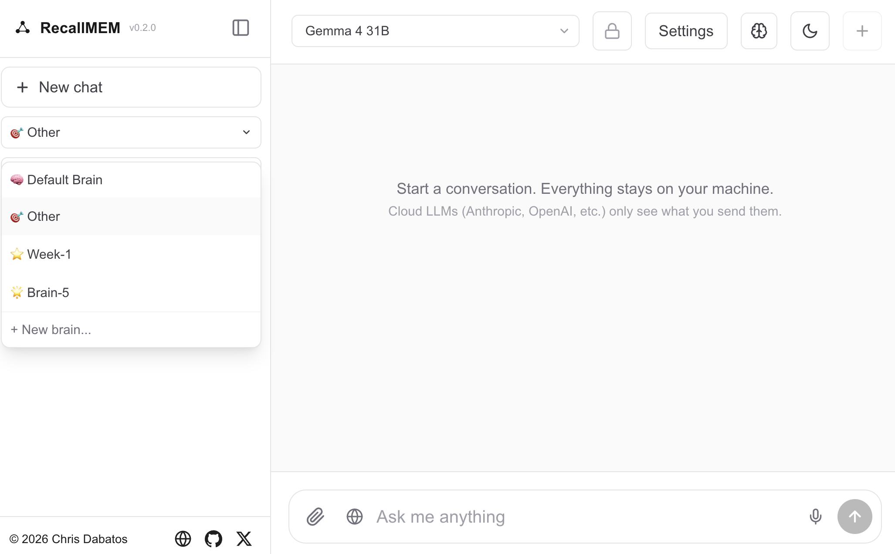

<p align="center">
  <picture>
    <source media="(prefers-color-scheme: dark)" srcset="./public/logo-hero-dark.svg">
    
  </picture>
</p>

<p align="center">
  <strong>Your Persistent Private AI that actually remembers you.</strong>
</p>

<p align="center">
  <code>npx recallmem</code>
</p>

<p align="center">
  Chatbots like ChatGPT, Claude, and Gemini tend to forget you the moment you end your session. RecallMEM doesn't. It builds a profile of who you are, extracts facts after every conversation, and runs vector search across your entire history to find relevant context. By the time you've used it for a week, it knows you better than any AI ever will.
</p>

<p align="center">
  Use it with Claude or OpenAI for fast responses and the best models (~5 minute setup). Or run everything locally with Gemma 4 for 100% privacy. You'll get the same memory framework either way. Your call.
</p>

<p align="center">
  
</p>

<p align="center">
  <em>Two chats. Different sessions. The AI remembers.</em>
</p>

---

## What is this

A personal AI chatbot with REAL memory. Plug in any LLM you want and RecallMEM gives it persistent memory of who you are, what you've talked about, and what's currently true vs historical. All your memory is stored in a local Postgres database on your machine, with pgvector powering the semantic search across your past conversations.

The best part is that **the LLM proposes, TypeScript decides.** Retrieval is deterministic SQL + cosine similarity, built by TypeScript before the model ever sees it. On the write side, an LLM proposes candidate facts and contradictions, but a 6-step TypeScript validator decides what actually gets stored. Facts have timestamps and get auto-retired when the truth changes ("works at Acme" → "left Acme"). [Deep dive on the architecture →](./docs/ARCHITECTURE.md)

You can run it three ways:

- **Cloud LLMs (recommended for most people).** Add a Claude or OpenAI API key in Settings. Fast, smart, works on any computer. Your memory still stays local in your own Postgres database. Only the chat messages go to the provider.
- **Local LLMs (recommended for privacy).** Run Gemma 4 via Ollama. Nothing leaves your machine, ever. Slower setup (~7-20 GB model download) and slower responses, but truly air-gappable.
- **Both.** Use cloud for daily chat, switch to local for the sensitive stuff. The model dropdown lets you pick per-conversation.

## How it compares

| Feature | **RecallMEM** | **ChatGPT / Claude.ai** | **Mem0** |
|---|---|---|---|
| **Deterministic memory** (no LLM on read, TS-gated writes, auto-retires stale facts) | ✅ Full | ❌ | ⚠️ Partial |
| **Multiple brains** (isolated memory namespaces per agent/project/user) | ✅ | ❌ | ❌ |
| **Runs locally** (own LLM, local models, no signup) | ✅ | ❌ | ❌ |
| **LLM agnostic** (Ollama, Anthropic, OpenAI, xAI, any OpenAI-compatible) | ✅ | ❌ | ⚠️ Partial |
| **Temporal + editable** (knows when facts were true, edit/delete, vector search) | ✅ | ⚠️ Partial | ⚠️ Partial |
| **Voice + vision** (STT/TTS, PDF image understanding) | ✅ | ⚠️ Partial | ❌ |
| **Open & free** (Apache 2.0, usage tracking, no account) | ✅ | ❌ | ⚠️ Partial |

## Features

- **Three-layer memory** across every chat: synthesized profile, extracted facts table, and vector search over all past conversations
- **Smart fact selection** using vector search on facts themselves, not just recent ones. Pinned identity facts + semantically relevant facts + recent facts.
- **Temporal awareness** so the model knows what's current vs. historical. Auto-retires stale facts when the truth changes.
- **Live fact extraction** after every assistant reply, not just when the chat ends
- **Multiple brains** for isolated memory namespaces (work, personal, demo, etc). Each brain has its own chats, facts, and profile. Stored in Postgres, not localStorage.
- **Memory inspector** where you can view, edit, or delete every fact
- **Vector search** across past conversations and facts with dated recall
- **Voice input (STT)** via Deepgram Nova-3 or local Whisper. Idle mic timeout after 60s of silence.
- **Text-to-speech (TTS)** via xAI Grok, OpenAI HD, Deepgram Aura-2, or free browser voice. Chunked playback for instant start on long responses.
- **Custom rules** for how you want the AI to talk to you
- **File uploads** (images, PDFs, code). PDFs are rendered page-by-page as images so the LLM sees charts and diagrams, not just extracted text.
- **Web search** when using Anthropic or Ollama (via Brave Search)
- **Usage tracking** with estimated costs for chat, TTS, and STT across all providers
- **Wipe memory unrecoverably** with `DELETE` + `VACUUM FULL` + `CHECKPOINT`
- **Bring any LLM.** Ollama, Anthropic, OpenAI, xAI (Grok), or any OpenAI-compatible API.

## Quick start (Mac)

Two options. Pick whichever fits your priority.

### Option A: Cloud LLM (Claude or OpenAI) — fastest, ~5 minutes

You need Node.js 20+ and [Homebrew](https://brew.sh). The installer uses Homebrew to set up Postgres + pgvector (where your memory and vector search live) and Ollama (for local AI models). Then:

```bash
npx recallmem
```

The installer sets up Postgres, pgvector, and Ollama (for the embedding model that powers memory). When the browser opens to `localhost:1337`:

1. Click **Settings** in the top right
2. Click **Providers**
3. Add your Claude or OpenAI API key
4. Pick that model from the dropdown in the chat header
5. Start chatting

**Total time: ~5 minutes.** The AI remembers everything across every chat. Your memory stays in your local Postgres database. Only the chat messages go to the cloud provider.

### Option B: Local Gemma 4 — 100% private, ~15-45 minutes

Same `npx recallmem` command. When the app opens, click **Settings → Manage models** and download one of these:

- **Gemma 4 E2B** (~7 GB, fastest download) — good for a quick test or older laptops
- **Gemma 4 E4B** (~10 GB) — good for most laptops
- **Gemma 4 26B** (~18 GB, ~20-30 minute download) — recommended for daily use
- **Gemma 4 31B** (~20 GB, slower, best quality)

Then pick that model from the dropdown and chat. Nothing leaves your machine.

<details>
<summary><strong>Linux (not officially supported, manual install)</strong></summary>

Auto-install isn't wired up for Linux. You'll need to install everything by hand:

```bash
# Postgres + pgvector (apt example)
sudo apt install postgresql-17 postgresql-17-pgvector
sudo systemctl start postgresql

# Ollama
curl -fsSL https://ollama.com/install.sh | sh
sudo systemctl start ollama
ollama pull embeddinggemma
ollama pull gemma4:26b

# Run
npx recallmem
```

</details>

<details>
<summary><strong>Windows (not supported, use WSL2)</strong></summary>

Native Windows is not supported. Use [WSL2](https://learn.microsoft.com/en-us/windows/wsl/install) with Ubuntu and follow the Linux steps above inside WSL.

</details>

## CLI commands

```bash
npx recallmem            # Setup if needed, then start the app
npx recallmem init       # Setup only (deps, DB, models, env)
npx recallmem start      # Start the server (assumes setup done)
npx recallmem doctor     # Check what's missing or broken
npx recallmem upgrade    # Pull latest code, run pending migrations
npx recallmem version    # Print version
```

## Privacy

If you only use Ollama, **nothing leaves your machine, ever.** You can air-gap the computer and it keeps working. If you add a cloud provider, only the chat messages and your assembled system prompt go to that provider's servers. Your database, embeddings, and saved API keys stay local.

## For developers

Underneath the chat UI, RecallMEM is a **deterministic memory framework** you can fork and use in your own AI app. The whole `lib/` folder is intentionally framework-shaped.

```
lib/
├── memory.ts        Memory orchestrator (profile + facts + vector recall in parallel)
├── prompts.ts       System prompt assembly with all memory context
├── facts.ts         Fact extraction (LLM proposes) + validation (TypeScript decides)
├── profile.ts       Synthesizes a structured profile from active facts
├── chunks.ts        Transcript splitting, embedding, vector search
├── chats.ts         Chat CRUD + transcript serialization
├── post-chat.ts     Post-chat pipeline (title, facts, profile rebuild, embed)
├── rules.ts         Custom user rules / instructions
├── embeddings.ts    EmbeddingGemma calls via Ollama
├── llm.ts           LLM router (Ollama, Anthropic, OpenAI, OpenAI-compatible)
└── db.ts            Postgres pool + configurable user ID resolver
```

Wire in your own auth with two calls at startup and every lib function respects it. See the [developer docs](./docs/DEVELOPERS.md) for embedding the memory layer into your own app, the database schema, testing, and optional Langfuse observability.

## Docs

| Doc | What's in it |
|---|---|
| [Architecture deep dive](./docs/ARCHITECTURE.md) | How deterministic memory works, read/write paths, validation pipeline, why the LLM is not in charge |
| [Developer guide](./docs/DEVELOPERS.md) | Embedding the memory framework, auth wiring, schema, testing, Langfuse setup |
| [Hardware guide](./docs/HARDWARE.md) | Which model fits which machine, RAM requirements, cloud vs. local tradeoffs |
| [Troubleshooting](./docs/TROUBLESHOOTING.md) | Every gotcha I've hit and how to fix it |
| [Manual install](./docs/MANUAL_INSTALL.md) | Step-by-step if you don't want to use the CLI |

## Limitations (v0.2)

No multi-user. No mobile app. Reasoning models (o1/o3, extended thinking) may have edge cases. Fact supersession is LLM-judged and intentionally conservative. See the [full limitations list](./docs/LIMITATIONS.md).

## Contributing

Forks, PRs, bug reports, ideas, all welcome. See [CONTRIBUTING.md](./CONTRIBUTING.md) for the dev setup.

## License

Apache 2.0. See [LICENSE](./LICENSE) and [NOTICE](./NOTICE). Use it, modify it, fork it, ship it commercially.

## Status

v0.2.0. It works. I use it every day.

I built RecallMEM because I wanted an AI that actually knows me. Not because I'm paranoid about privacy (though that's a nice bonus). The chat models you use today forget you the second you close the tab and that drives me crazy. So I fixed it.

There's no CI, no error monitoring, no SLA. If you want to use it as your daily AI tool, fork it, make it yours, and expect to read the code if something breaks. That's the deal. If this is useful to you, that's cool. If not, no hard feelings.

[github.com/RealChrisSean/RecallMEM](https://github.com/RealChrisSean/RecallMEM)
