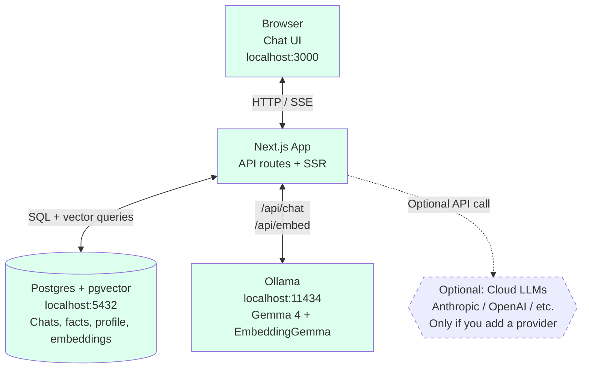
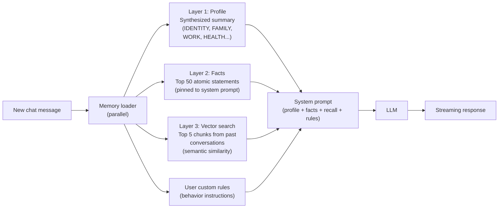
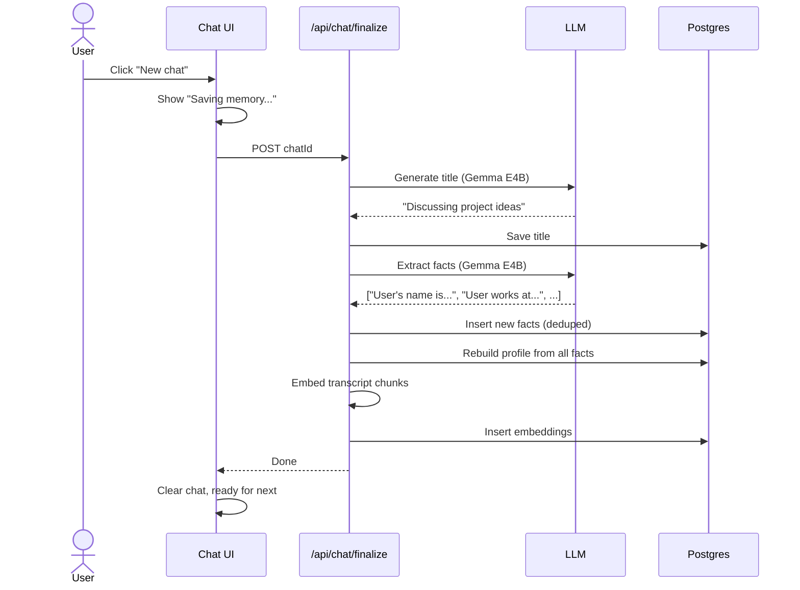
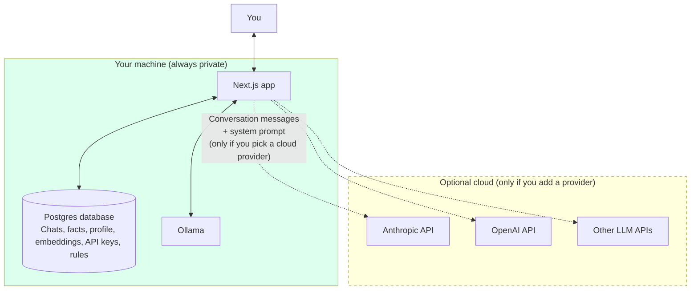

<p align="center">
  <picture>
    <source media="(prefers-color-scheme: dark)" srcset="./public/logo-hero-dark.svg">
    
  </picture>
</p>

<p align="center">
  <strong>Persistent Private AI.</strong> Powered by Gemma 4 running locally on your own machine.
</p>

**Just want to install it?** Jump straight to [Quick start](#quick-start).


<p align="center">
  
</p>

<p align="center">
  <em>Two chats. Different sessions. The AI remembers.</em>
</p>

---

## Why I built this

I wanted my own private AI for the kind of conversations I don't want sitting on someone else's server. Personal stuff. The stuff you'd actually want a real friend to help you think through.

The default model is **Gemma 4** (Google's open weights model that just dropped, Apache 2.0) running locally via Ollama. You can pick any size from E2B (runs on a phone) up to the 31B Dense (best quality, needs a workstation). Or skip Ollama entirely and bring your own API key for Claude, GPT, Groq, Together, OpenRouter, or anything OpenAI-compatible. Your call.

The thing is, the memory is the actual differentiator. Not the model. Not the UI. The memory. The AI builds a profile of who you are over time. It extracts facts after every conversation. It vector-searches across every chat you've ever had to find relevant context. By the time you've used it for a week, it knows you better than ChatGPT ever will, because ChatGPT forgets you the second you close the tab.

<details>
<summary><strong>The longer version (what's wrong with every other "private AI" tool)</strong></summary>

Here's the problem with every "private AI" tool I tried: they all fall into one of three buckets.

1. **Local chat UIs for Ollama.** Look pretty, but the AI has zero memory between conversations. Every chat is a stranger.
2. **Memory libraries on GitHub.** Powerful, but they're SDKs. You have to build the whole UI yourself.
3. **Cloud-based memory products like Mem0.** Have the full feature set, but your data goes to their servers. Defeats the whole point.

There's a gap right in the middle: a **complete personal AI app with real working memory that runs 100% on your machine**. So I built it.

</details>

---

## What it does

Persistent memory across every chat (profile + facts + vector search) with **temporal awareness** so the model knows what's current vs historical. Auto-extracts facts in real time, retires stale ones when the truth changes, stamps every memory with dates. Vector search over every past chat. Memory inspector you can edit. Custom rules. Wipe memory unrecoverably. File uploads (images, PDFs, code). Web search when using Anthropic. Bring your own LLM (Ollama, Anthropic, OpenAI, or any OpenAI-compatible API). Warm Claude-style dark mode.

<details>
<summary><strong>Full feature list</strong></summary>

- **Persistent memory across every chat.** Three layers: a synthesized profile of who you are, an extracted facts table, and vector search over all past conversations.
- **Live fact extraction.** Facts get extracted after every assistant reply, not just when the chat ends. Say "my birthday is 11/27" and refresh `/memory` a moment later, it's already there. Always uses the local FAST_MODEL so cloud users don't get billed per turn.
- **Temporal awareness solves context collapse.** Every fact is stamped with a `valid_from` date. When new information contradicts an old fact ("left Acme" replaces "works at Acme"), the old fact gets retired automatically. The model always sees what's current.
- **Self-healing categories.** Facts re-route to the correct category after every chat, edit, or delete. No LLM, just a deterministic loop. So when the categorizer improves, your existing memory improves with it.
- **Resumed-conversation markers.** Open a chat from last week and continue it, the AI sees a system marker like `[Conversation resumed 6 days later]` so it knows time passed and earlier turns are historical.
- **Dated recall.** When the vector search pulls relevant chunks from past chats, each one is prefixed with the date it came from so the model can tell history from the present.
- **Auto-builds your profile** from the extracted facts, with date stamps in every section. Updates after every reply.
- **Vector search across past conversations.** Ask about something you discussed last month, the AI finds it and uses it as context.
- **Memory inspector page.** View, edit, or delete every fact, with collapsible category sections and a search filter for navigating long lists.
- **Sidebar chat search.** Toggle between vector search (semantic, needs Ollama for embeddings) and text search (literal ILIKE on titles + transcripts, instant). Both search inside the conversations, not just titles.
- **Web search toggle.** When you're using an Anthropic provider, a globe button next to the input lets Claude actually browse the web. Hidden for Ollama since local models don't have it.
- **Custom rules.** Tell the AI how you want to be talked to. "Don't gaslight me." "I have dyslexia, no bullet points." "Don't add disclaimers." It applies them in every chat.
- **Wipe memory unrecoverably.** `DELETE` + `VACUUM FULL` + `CHECKPOINT`. Gone for good at the database level.
- **File uploads.** Drag and drop images, PDFs, code, text. Gemma 4 handles vision natively.
- **Warm dark mode.** Claude-style charcoal palette via CSS variables, persisted across refreshes with no flash-of-light.
- **Chat history sidebar** with date grouping, pinned chats, and the search toggle described above.
- **Markdown rendering** for headings, code blocks, tables.
- **Streaming responses** with smooth typewriter rendering.
- **Bring any LLM you want.** Local Gemma 4 via Ollama, or plug in Anthropic (Claude), OpenAI (GPT), or any OpenAI-compatible API (Groq, Together, OpenRouter, Mistral, vLLM, LM Studio, etc).
- **Test connection** for cloud providers before saving the API key, so you don't find out your key is wrong mid-chat.

</details>

---

## How is this different?

<details>
<summary><strong>Comparison table vs ChatGPT, Claude.ai, and Mem0</strong></summary>

| | RecallMEM | ChatGPT / Claude.ai | Mem0 |
|---|---|---|---|
| **Runs locally** | ✅ | ❌ | ❌ |
| **Memory retrieval is deterministic (no LLM tool calls)** | ✅ | ❌ | ❌ |
| **Persistent memory across chats** | ✅ | partial | ✅ |
| **Temporal awareness (memories know when they were true)** | ✅ | ❌ | ❌ |
| **Auto-retires stale facts when truth changes** | ✅ | ❌ | ❌ |
| **You can edit / delete memories** | ✅ | partial | ✅ |
| **Vector search over past chats** | ✅ | ❌ | ✅ |
| **Custom rules / behavior** | ✅ | ✅ | ❌ |
| **Bring your own LLM (any provider)** | ✅ | ❌ | ❌ |
| **Use local models (Gemma 4, Llama, etc)** | ✅ | ❌ | ❌ |
| **No account / no signup** | ✅ | ❌ | ❌ |
| **Free** | ✅ | partial | partial |
| **Source available** | ✅ Apache 2.0 | ❌ | partial |

</details>

<details>
<summary><strong>The actual differentiator nobody talks about (deterministic memory)</strong></summary>

The thing nobody is doing right is **how memory is read and written**.

In ChatGPT and Claude.ai with memory turned on, the LLM is in charge of memory. The model decides when to remember something during your conversation. The model decides what to remember. The model decides what to retrieve when you ask a question. The whole memory layer is implemented as model behavior. You're trusting the LLM to be a librarian, and LLMs are not librarians. They hallucinate.

RecallMEM does it backwards. **The chat LLM never touches your memory database.** Not for reads, not for writes. The LLM only ever sees a system prompt that's already been assembled by deterministic TypeScript and SQL. Here's the actual flow:

**When you send a message (memory READ path, 100% deterministic):**

1. Plain SQL `SELECT` pulls your profile from `s2m_user_profiles`
2. Plain SQL `SELECT` pulls your top *active* facts from `s2m_user_facts` (retired facts are excluded automatically)
3. Each fact is stamped with its `valid_from` date so the model can reason about timelines
4. EmbeddingGemma converts your message to a 768-dim vector (math, not generation)
5. pgvector cosine similarity search ranks chunks from past conversations
6. Each retrieved chunk is stamped with its source-chat date (`[from conversation on 2026-03-12]`) so the model can tell history from now
7. If the chat is being resumed after a multi-hour gap, a one-time system marker like `[Conversation resumed 6 days later]` gets injected before the new user turn
8. TypeScript template assembles all of it into a system prompt
9. **Then** the chat LLM gets called, with the assembled context already in its prompt

The chat LLM never queries the database. It can't decide what to retrieve. It can't pick which facts are relevant. It can't hallucinate a memory that doesn't exist, because if it's not in the prompt, it doesn't exist for the model. The retrieval is 100% deterministic SQL + cosine similarity. No LLM tool calls touching your memory store.

**After every assistant reply (memory WRITE path, LLM proposes, TypeScript validates):**

A small local LLM (Gemma 4 E4B via Ollama) runs in the background to extract candidate facts from the running transcript. This happens fire-and-forget after the stream closes, so you never wait for it. It always uses the local model regardless of which provider the chat itself is using, so cloud users (Claude, GPT) don't get billed per turn for extraction.

The same LLM call also returns the IDs of any **existing** facts the new conversation contradicts. So when you say "I just left Acme to start a new job," the extractor returns the new fact AND flags the old "User works at Acme" fact for retirement. The TypeScript layer flips those rows to `is_active=false` and stamps `valid_to=NOW()`. History is preserved, the active set always reflects current truth.

But here's the key: the LLM only **proposes** facts and supersession decisions. It cannot write to the database. The TypeScript layer is the actual gatekeeper, and it runs every candidate fact through six validation steps before storage:

1. **Quality gate.** Conversations under 100 characters get zero facts extracted. The LLM never even sees them.
2. **JSON parse validation.** If the LLM returns malformed JSON or no array, the entire batch is dropped.
3. **Type validation.** Only strings survive. Objects, numbers, nested arrays, all rejected.
4. **Garbage pattern filtering.** A regex filter catches the most common LLM hallucinations: meta-observations like "user asked about X", AI behavior notes like "AI suggested Y", non-facts like "not mentioned", mood observations like "had a good conversation", and anything under 10 characters.
5. **Deduplication.** Case-insensitive normalized match against the entire facts table. Duplicates get dropped.
6. **Categorization.** The category (Identity, Family, Work, Health, etc.) is decided by **keyword matching in TypeScript**, not by the LLM. The LLM has no say in how facts get organized.

After all six steps, the surviving facts get a plain SQL `INSERT`. And even then, you can edit or delete any fact in the Memory page if you don't agree with it.

**Why this matters:**

- **Predictability.** When you mention "my dog" in a chat, RecallMEM **always** retrieves the facts that match "dog" via cosine similarity. ChatGPT retrieves whatever the model decides to retrieve, which can vary run to run.
- **No hallucinated retrieval.** The LLM cannot remember something that isn't actually in your facts table. If it's not in the database, it's not in the prompt.
- **Auditability.** You can look at any chat and trace exactly which facts and chunks were loaded into the system prompt. With ChatGPT, you can't see what the model decided to surface from memory.
- **No prompt injection memory leaks.** The LLM in RecallMEM only sees what the deterministic layer feeds it. It can't query the rest of the database. With ChatGPT, the model has tool access to memory, which means a prompt injection attack could theoretically make it dump memory contents.
- **Your data, your database.** Memory is data you control, not behavior you have to trust the model to do correctly. You can write a script that queries Postgres directly, edit facts manually, run analytics on your own conversations.

This is the actual reason RecallMEM exists. Not "another local chat UI." A memory architecture where the LLM is intentionally not in charge.

</details>

---

## For developers (the memory framework)

Underneath the chat UI, RecallMEM is a **deterministic memory framework** you can fork and use in your own AI app. The whole `lib/` folder is intentionally framework-shaped. It's not a polished SDK with a public API contract, but it IS a working, opinionated memory architecture you can copy into your own project.

<details>
<summary><strong>What's in <code>lib/</code> and how to embed it in your app</strong></summary>

**The core files in `lib/`:**

```
lib/
├── memory.ts        Memory orchestrator. Loads profile + facts + vector recall in parallel.
├── prompts.ts       Assembles the system prompt with all the memory context.
├── facts.ts         Fact extraction (LLM proposes) + validation (TypeScript decides).
├── profile.ts       Synthesizes a structured profile from the active facts.
├── chunks.ts        Splits transcripts into chunks, embeds them, runs vector search.
├── chats.ts         Chat CRUD + transcript serialization with the smart parser.
├── post-chat.ts     The post-chat pipeline (title gen, fact extract, profile rebuild, embed).
├── rules.ts         Custom user rules / instructions.
├── embeddings.ts    EmbeddingGemma calls via Ollama.
├── llm.ts           LLM router (Ollama, Anthropic, OpenAI, OpenAI-compatible).
└── db.ts            Postgres pool + the configurable user ID resolver.
```

**Embedding it into your own app:**

The lib functions default to a single-user setup (`user_id = "local-user"`) but you can wire in your own auth system with two function calls at startup:

```typescript
import { Pool } from "pg";
import { configureDb, setUserIdResolver } from "./lib/db";

// Use your existing Postgres pool (or skip this and let lib/ create its own)
const myPool = new Pool({ connectionString: process.env.DATABASE_URL });
configureDb({ pool: myPool });

// Wire in your auth system. Called whenever a lib function needs the current user.
// Can be sync or async. Return whatever string identifies the user in your app.
setUserIdResolver(() => getCurrentUserFromMyAuthSystem());
```

That's it. No other changes needed. Every lib function (`getProfile`, `getActiveFacts`, `searchChunks`, `storeFacts`, `rebuildProfile`, etc.) reads from the configured resolver. Your auth system stays in your code, the memory framework stays in `lib/`.

**Using the memory layer in a chat request:**

```typescript
import { buildMemoryAwareSystemPrompt } from "./lib/memory";
import { runPostChatPipeline } from "./lib/post-chat";
import { createChat, updateChat } from "./lib/chats";

// 1. Build the system prompt from the user's memory
const systemPrompt = await buildMemoryAwareSystemPrompt(
  userMessage,
  currentChatId
);

// 2. Send to your LLM however you want (Ollama, Claude, GPT, whatever)
const response = await yourLLM.chat([
  { role: "system", content: systemPrompt },
  ...conversationHistory,
  { role: "user", content: userMessage },
]);

// 3. Save the chat
await updateChat(chatId, [...conversationHistory, { role: "assistant", content: response }]);

// 4. (Async) Run the post-chat pipeline to extract facts, rebuild profile, embed chunks
runPostChatPipeline(chatId);
```

The memory framework doesn't care which LLM you use. It just assembles context. Bring your own model.

**The schema lives in `migrations/001_init.sql`.** Run it against any Postgres 17+ database with the pgvector extension installed. Tables are prefixed `s2m_` (for "speak2me," the project this came from). Rename them in the migration if you want a different prefix.

**License:** Apache 2.0. Fork it, modify it, ship it commercially. The only ask is that you preserve the copyright notice and the NOTICE file. See [CONTRIBUTING.md](./CONTRIBUTING.md) for the full guide.

</details>

---

## Quick start

### Step 1: Make sure you have Node and Homebrew

You need two things on your Mac before running RecallMEM:

- **Node.js 20 or higher.** Check with `node --version`. If it says `command not found` or a number less than 20, install it: `brew install node`.
- **Homebrew.** Check with `brew --version`. If it's missing, get it from [brew.sh](https://brew.sh).

That's it for prereqs. Everything else gets installed for you in step 2.

### Step 2: Run one command

```bash
npx recallmem
```

That's the whole install. Here's what happens after you hit Enter, in order:

1. **It checks what you already have.** Node, Postgres, pgvector, Ollama. Whatever's already installed, it skips.
2. **It shows you a list of what's missing.** Plain English, with ✓ and ✗ marks.
3. **It asks one question:** "Install everything now? [Y/n]". Hit Enter to say yes.
4. **It runs `brew install` for everything missing.** Postgres 17, pgvector, Ollama. You'll see real-time progress in your terminal.
5. **It starts Postgres and Ollama as background services** so they keep running across reboots. No "fetch failed" surprises.
6. **It downloads EmbeddingGemma** (~600 MB, takes 1-2 min). This is required for the memory system to work.
7. **It asks which Gemma 4 chat model you want to install.** Three options:
   - **1) Gemma 4 26B** — 18 GB, fast, recommended for most people
   - **2) Gemma 4 31B** — 19 GB, slower, smartest answers
   - **3) Gemma 4 E2B** — 2 GB, very fast, good for testing or older laptops
8. **It downloads whichever model you picked.** The 2 GB E2B option finishes in 2-3 min on most internet. The 18 GB option takes 10-30 min depending on your connection.
9. **It runs database migrations** (~5 seconds).
10. **It builds the production app** (~30-60 seconds).
11. **It starts the server.** Open `http://localhost:3000` in your browser and start chatting.

The first run takes anywhere from 5 minutes (E2B model on fast internet) to 45 minutes (31B model on slower internet). Most of that time is the model download, not RecallMEM itself. You can walk away — nothing else asks for your input.

### Want a different model later?

Run any of these in your terminal at any time:

```bash
ollama pull gemma4:26b
ollama pull gemma4:31b
ollama pull gemma4:e2b
```

Then refresh RecallMEM and pick the new model from the dropdown at the top of the chat.

### Just want to use cloud models (Claude / GPT) and skip the local stuff?

You still need Postgres (for storing your memory locally), but you can skip Ollama and the Gemma download entirely. When the installer asks "Install everything now?", say no, then install just Postgres yourself:

```bash
brew install postgresql@17 pgvector
brew services start postgresql@17
npx recallmem
```

After the app starts, go to **Settings → Providers → Add a new provider**, paste your Anthropic or OpenAI API key, then pick that model from the dropdown in the chat header.

### Linux

Auto-install on Linux isn't fully wired up yet (the installer prints clear manual instructions if you run it on Linux). You can do it by hand:

```bash
# Postgres + pgvector via your distro's package manager
# (apt: postgresql-17 postgresql-17-pgvector, dnf: postgresql17 pgvector_17, etc)
sudo systemctl start postgresql

# Ollama
curl -fsSL https://ollama.com/install.sh | sh
sudo systemctl start ollama
ollama pull embeddinggemma
ollama pull gemma4:26b   # or gemma4:e2b for smaller

# Then run
npx recallmem
```

### Windows

Native Windows isn't supported. Use [WSL2](https://learn.microsoft.com/en-us/windows/wsl/install) with Ubuntu and follow the Linux steps above inside WSL.

### Troubleshooting

- **"Homebrew is required to auto-install dependencies"** → Install Homebrew from [brew.sh](https://brew.sh), then re-run `npx recallmem`.
- **"fetch failed" when sending a message** → Ollama isn't running. Run `brew services start ollama` and refresh the page. The new installer should prevent this from happening on first install, but if you reboot your Mac and forget that brew services restarts on login, this is the fix.
- **"Postgres is not running"** → `brew services start postgresql@17`.
- **The setup script asked which model and I picked the wrong one** → Just run `ollama pull gemma4:NEW_SIZE` in your terminal and pick the new one from the chat dropdown. Nothing to redo.

<details>
<summary><strong>Architecture diagrams (system, memory layers, post-chat sequence)</strong></summary>

### System architecture



Everything in green runs on your machine. The dashed cloud box only activates if you explicitly add a cloud provider in settings. Otherwise, nothing leaves your computer. Ever.

### The three-layer memory system



Each layer does a different job:

- **Profile** loads instantly. It's the "who am I talking to" baseline. One database row, always loaded into every system prompt.
- **Facts** are atomic statements you can view, edit, and delete. Stored as individual rows. Pinned into the prompt every conversation.
- **Vector search** finds semantically relevant prose from any past conversation. Catches the stuff that doesn't fit cleanly into facts, like that idea you were working through three weeks ago.

Together, they let the AI know your name, your family, your job, AND remember the specific thing you mentioned a month ago when it becomes relevant.

### What happens when you end a chat



Click "New chat", wait a few seconds, and the next conversation immediately sees the new memory.

</details>

<details>
<summary><strong>Hardware requirements (which model fits which machine)</strong></summary>

The biggest variable is which LLM you pick. RecallMEM lets you choose.

### Fully open source (Ollama + Gemma 4 locally)

| Setup | Model | RAM | Speed | Quality |
|---|---|---|---|---|
| Phone / iPad | Gemma 4 E2B | 8GB | Fast | Basic |
| MacBook Air / Mac Mini M4 | Gemma 4 E4B | 16GB | Fast | Good |
| Mac Studio M2+ | Gemma 4 26B MoE | 32GB+ | Very fast | Great |
| Workstation / server | Gemma 4 31B Dense | 32GB+ | Slower | Best |

The 26B MoE is what I use as the default. It's a Mixture of Experts model, so it only activates 3.8B parameters per token even though it has 26B total. Much faster than the 31B Dense, almost the same quality. Ranked #6 globally on the Arena leaderboard.

### Using cloud providers (Claude, GPT, Groq, etc.)

If you don't want to run a local LLM at all, you can plug in any cloud API:

| Setup | RAM | Notes |
|---|---|---|
| Any laptop | ~4GB free | Just runs Postgres + the Node.js app + browser. The LLM runs on the provider's servers. |

You bring your own API key. The database, memory, profile, and rules still stay on your machine. Only the chat messages get sent to the provider.

**One thing to know:** when you use a cloud provider, your conversation goes to their servers. Your facts and profile get sent as part of the system prompt so the cloud LLM has context. This breaks the local-only guarantee for those specific conversations. Use Ollama for anything you want fully private.

</details>

<details>
<summary><strong>CLI commands</strong></summary>

```bash
npx recallmem            # Setup if needed, then start the app
npx recallmem init       # Setup only (deps check, DB, models, env)
npx recallmem start      # Start the server (assumes setup was done)
npx recallmem doctor     # Check what's missing or broken
npx recallmem upgrade    # Pull latest code, run pending migrations
npx recallmem version    # Print version
npx recallmem --help     # Show help
```

The default `npx recallmem` is what you'll use 99% of the time. It's smart about its state. On the first run it sets everything up, on subsequent runs it just starts the server.

If something breaks, run `npx recallmem doctor` first. It tells you exactly what's wrong and how to fix it.

</details>

<details>
<summary><strong>Two ways to use it (just-run-it vs fork-and-hack)</strong></summary>

The `npx recallmem` command auto-detects which workflow you're in.

### Workflow 1: Just run it (most users)

You want to use RecallMEM as your daily AI tool. You don't care about the code.

```bash
npx recallmem
```

The CLI:
1. Detects nothing is installed yet
2. Clones the repo to `~/.recallmem` (one-time, ~50MB)
3. Runs `npm install` inside `~/.recallmem`
4. Checks your dependencies (Postgres, pgvector, Ollama)
5. Pulls the embedding model if missing
6. Asks if you want to pull a chat model (~18GB, optional)
7. Creates the database, runs migrations, writes the config file
8. Starts the server and opens the chat in your browser

Subsequent runs are instant. Just `npx recallmem` and the chat opens.

To upgrade later when I ship a new version:

```bash
npx recallmem upgrade
```

That does a `git pull`, runs `npm install` if deps changed, and applies any pending migrations.

### Workflow 2: Fork it and hack on it (developers)

You want to modify the code, contribute back, run your own variant.

```bash
git clone https://github.com/RealChrisSean/RecallMEM.git
cd RecallMEM
npm install
npx recallmem
```

The CLI detects you're already inside a recallmem checkout and uses your current directory instead of cloning to `~/.recallmem`. Hot reload works. Edits to the code are reflected immediately on the next dev server reload.

Same `npx recallmem` command. Different behavior because the CLI is smart about where it's running.

See [CONTRIBUTING.md](./CONTRIBUTING.md) for the dev workflow.

**Testing:**

```bash
npm test          # run the suite once
npm test:watch    # re-run on file change
```

The test suite uses Vitest and currently covers the deterministic memory primitives (keyword inflection, the categorization router, and the regression cases that have bitten us in the past — `son` matching `Sonnet`, `work` matching `framework`, etc). It's intentionally narrow and fast (~150ms). New tests go in `test/unit/` and follow the same shape as `test/unit/facts.test.ts`. No DB or LLM required, pure functions only.

**Optional observability (Langfuse):**

If you're hacking on RecallMEM and want full trace timelines for every chat turn (memory build, LLM generation, fact extraction, supersession decisions, etc), there's a built-in Langfuse integration. It's a peer dependency, so it's NOT installed by default and zero cost when unused.

```bash
npm install langfuse
```

Then set these in `.env.local`:

```
LANGFUSE_PUBLIC_KEY=pk-lf-...
LANGFUSE_SECRET_KEY=sk-lf-...
LANGFUSE_BASEURL=http://localhost:3000  # optional, defaults to cloud.langfuse.com
```

Self-host Langfuse via Docker so traces stay on your machine. This is a developer-only debugging tool. Trace payloads include the actual user message content, so don't enable it on machines where conversation contents shouldn't leave the local environment.

</details>

<details>
<summary><strong>Where things live on disk (and how to fully uninstall)</strong></summary>

The default install location is `~/.recallmem`. Override with `RECALLMEM_HOME=/custom/path npx recallmem` if you want it somewhere else.

What's in `~/.recallmem`:

- The full RecallMEM source code (cloned from GitHub)
- `node_modules/` with all dependencies
- `.env.local` with your config
- The Next.js build output (when you run it)

What's NOT in `~/.recallmem`:

- Your conversations, facts, profile, embeddings, rules, and API keys. Those all live in your Postgres database at `/opt/homebrew/var/postgresql@17/` (Mac) or `/var/lib/postgresql/` (Linux). The Postgres data directory is the actual source of truth.

To completely uninstall:

```bash
rm -rf ~/.recallmem        # Remove the app
dropdb recallmem           # Remove the database (or use the in-app "Nuke everything" button first)
```

</details>

---

## Privacy

If you only use Ollama, **nothing leaves your machine, ever**. You can air-gap the computer and it keeps working. If you add a cloud provider (Claude, GPT, etc.), only the chat messages and your assembled system prompt go to that provider's servers. Your database, embeddings, and saved API keys stay local.

<details>
<summary><strong>Privacy diagram + truly unrecoverable deletion</strong></summary>



**Always on your machine, never sent anywhere:**
- Your chat history
- Your facts and profile
- Your custom rules
- Your vector embeddings
- Your saved API keys

**Sent only when you actively use a cloud provider:**
- The current conversation messages
- The system prompt (which includes your profile, facts, and rules so the cloud LLM has context)

### Truly unrecoverable deletion

When you click "Wipe memory" or "Nuke everything" on the Memory page, the app runs:

1. `DELETE` to remove rows from query results
2. `VACUUM FULL <table>` to physically rewrite the table on disk and release the dead row space
3. `CHECKPOINT` to force Postgres to flush WAL log files

After those three steps, the data is gone from the database in any practically recoverable way.

**One thing I want to be honest about:** filesystem-level forensic recovery (raw disk block scanning) is a separate problem. SSDs have wear leveling, so file overwrites don't always touch the original physical cells. The complete solution is **full-disk encryption** (FileVault on Mac, LUKS on Linux, BitLocker on Windows). With disk encryption and a strong login password, the data is genuinely unrecoverable. Not even Apple could read it.

</details>

---

<details>
<summary><strong>What it doesn't do (yet), honest limitations</strong></summary>

I'm being honest about the limitations. This is v0.1.

- **No voice yet.** It's text only. I want to add Whisper for speech-to-text and Piper for text-to-speech, both local. On the roadmap.
- **Web search works on Anthropic and Ollama. OpenAI not yet.** Anthropic uses the native `web_search_20250305` tool, no setup. Ollama (Gemma) uses **Brave Search** as a backend, which needs a free API key (5 minute setup): sign up at [brave.com/search/api](https://brave.com/search/api), pick the Free tier (2,000 searches/month), and add `BRAVE_SEARCH_API_KEY=your_key_here` to your `.env.local`. Then restart RecallMEM. When you toggle web search on the chat UI, the first time you'll see a privacy modal explaining that Brave will see your message text but NOT your memory, profile, facts, or past conversations. If the key isn't set or the quota is exhausted, the toggle still works but the AI will tell you what to do instead of failing silently. OpenAI's native web search requires the Responses API path which isn't plumbed through yet.
- **No multi-user.** This is a personal app for one person on one machine. If you want a multi-user version, that's a separate fork.
- **Reasoning models (OpenAI o1/o3, Claude extended thinking) might have edge cases.** They use different API parameters that I don't fully handle yet. Standard chat models work fine.
- **OpenAI vision isn't fully wired up.** Gemma 4 (4B and up) handles images natively via Ollama. OpenAI uses a different format that I haven't plumbed through. Use Ollama or Anthropic for images.
- **No mobile app.** It's a web app you run locally. You access it from your browser at `localhost:3000`. A native iOS/Android app is theoretically possible but it's a separate project I haven't started.
- **Fact supersession is LLM-judged and conservative.** The local Gemma extractor decides whether a new fact contradicts an old one. It's intentionally cautious (only retires a fact when the replacement is unambiguous), so it might occasionally miss a real contradiction or, more rarely, retire something it shouldn't have. You can always inspect and edit/restore in the Memory page. For higher-stakes use cases, you'd want a stricter rule-based supersession layer on top, or a periodic profile-rebuild from full history.

</details>

<details>
<summary><strong>Tech stack</strong></summary>

- **Frontend / Backend:** Next.js 16 (App Router) + TypeScript + Tailwind CSS v4
- **Database:** Postgres 17 + pgvector (HNSW vector indexes)
- **Local LLM:** Ollama with Gemma 4 (E2B / E4B / 26B MoE / 31B Dense)
- **Embeddings:** EmbeddingGemma 300M (768 dimensions, runs in Ollama)
- **PDF parsing:** pdf-parse v2
- **Markdown rendering:** react-markdown + remark-gfm + @tailwindcss/typography
- **Cloud LLM transports (optional):** Anthropic Messages API, OpenAI Chat Completions, OpenAI-compatible

</details>

<details>
<summary><strong>Manual install (for the curious or for when <code>npx recallmem</code> can't be used)</strong></summary>

If you want to know what `npx recallmem` is doing under the hood, or you don't want to use the CLI for some reason, here's the manual install.

### macOS

```bash
# 1. Install Node.js
brew install node

# 2. Install Postgres 17 + pgvector
brew install postgresql@17 pgvector
brew services start postgresql@17

# 3. Install Ollama (skip if using cloud only)
brew install ollama
brew services start ollama

# 4. Pull the models
ollama pull embeddinggemma      # ~600MB, REQUIRED
ollama pull gemma4:26b          # ~18GB, recommended chat model
ollama pull gemma4:e4b          # ~4GB, fast model for background tasks
```

### Linux (Ubuntu/Debian)

```bash
# 1. Node.js
curl -fsSL https://deb.nodesource.com/setup_20.x | sudo -E bash -
sudo apt install -y nodejs

# 2. Postgres + pgvector
sudo apt install postgresql-17 postgresql-17-pgvector
sudo systemctl start postgresql

# 3. Ollama
curl -fsSL https://ollama.com/install.sh | sh

# 4. Pull models
ollama pull embeddinggemma
ollama pull gemma4:26b
ollama pull gemma4:e4b
```

### Windows

Use WSL2 with Ubuntu and follow the Linux steps. Native Windows works too but it's rougher.

### Setup

```bash
# 1. Clone the repo
git clone https://github.com/RealChrisSean/RecallMEM.git
cd RecallMEM

# 2. Install dependencies
npm install

# 3. Create the database
createdb recallmem

# 4. Run migrations
npm run migrate

# 5. Configure .env.local
cat > .env.local <<EOF
DATABASE_URL=postgres://$USER@localhost:5432/recallmem
OLLAMA_URL=http://localhost:11434
OLLAMA_CHAT_MODEL=gemma4:26b
OLLAMA_FAST_MODEL=gemma4:e4b
OLLAMA_EMBED_MODEL=embeddinggemma
EOF

# 6. Start the dev server
npm run dev
```

Open [http://localhost:3000](http://localhost:3000).

</details>

<details>
<summary><strong>Troubleshooting (the real gotchas I hit)</strong></summary>

Stuff I've actually hit. If you run into something else, run `npx recallmem doctor` first. It tells you exactly what's broken.

**`createdb: command not found`**

Add Postgres to your PATH:
```bash
export PATH="/opt/homebrew/opt/postgresql@17/bin:$PATH"
```

**`extension "vector" is not available`**

You're running Postgres 16 or older. The `pgvector` Homebrew bottle only ships extensions for Postgres 17 and 18. Switch to `postgresql@17`. I learned this the hard way. The install error message is cryptic and the fix took me 30 minutes the first time.

**Ollama silently fails to pull a new model**

You've got a version mismatch between the Ollama CLI and the Ollama server. This bites you if you have both Homebrew Ollama AND the desktop Ollama app installed. Check `ollama --version`. Both client and server should match.

```bash
brew upgrade ollama
pkill -f "Ollama"            # kill the old desktop app server
brew services start ollama   # start the new server from Homebrew
```

**Gemma 4 31B is slow**

Two reasons:

1. **Thinking mode is on.** The app already disables it via `think: false`, but if you bypass the app and call Ollama directly, you'll see slow responses. Gemma 4 spends a ton of tokens "thinking" before answering when it's enabled.
2. **Dense vs MoE.** 31B Dense activates all 31B parameters per token. Switch to `gemma4:26b` (Mixture of Experts, only 3.8B active per token) for ~3-5x the speed with minimal quality loss. This is what I use as the default.

**"My memory isn't being used in new chats"**

Make sure you click "New chat" (or switch to another chat in the sidebar) to trigger the synchronous "Saving memory..." finalize step. If you just refresh the browser without ending the chat, the post-chat pipeline runs as a best-effort `sendBeacon()` and may not finish before the next chat starts.

The fix: always click "New chat" or switch chats in the sidebar before closing the browser if you said something you want remembered.

</details>

---

## Contributing

Forks, PRs, bug reports, ideas, all welcome. See [CONTRIBUTING.md](./CONTRIBUTING.md) for the dev setup and how the codebase is organized.

If you build something cool on top of RecallMEM, I'd love to hear about it.

## License

Apache License 2.0. See [LICENSE](./LICENSE) for the full text and [NOTICE](./NOTICE) for third-party attributions. You can use, modify, fork, and redistribute this for any purpose, personal or commercial. The license includes a patent grant and the standard "no warranty, no liability" disclaimer.

## Status

This is v0.1. It works. I use it every day.

It's also not "production ready" in the corporate sense. There's no CI, no error monitoring, no SLA. There's a small Vitest test suite that covers the deterministic memory primitives (keyword routing, inflection, regression cases), but it's intentionally narrow. If you want to use it as your daily AI tool, fork it, make it yours, and expect to read the code if something breaks. That's the deal.

I built RecallMEM because I wanted my own private AI. I'm sharing it because there's a real gap in the local AI ecosystem and someone needed to fill it. If this is useful to you, that's cool. If not, no hard feelings.

The repo: [github.com/RealChrisSean/RecallMEM](https://github.com/RealChrisSean/RecallMEM)
