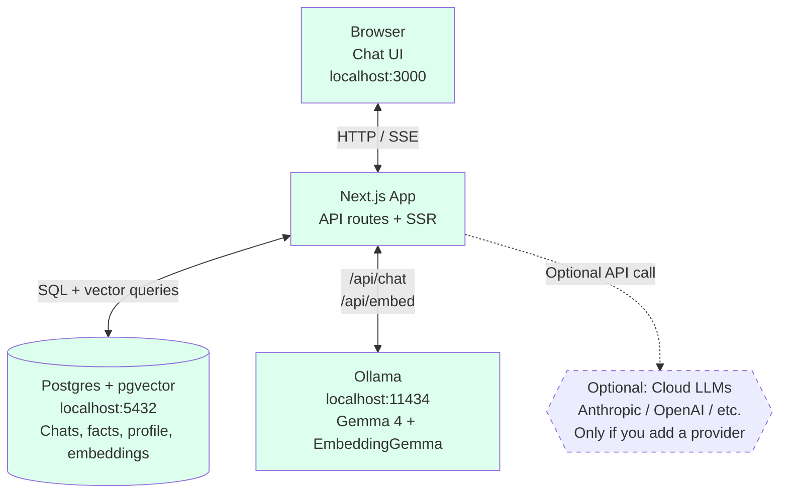
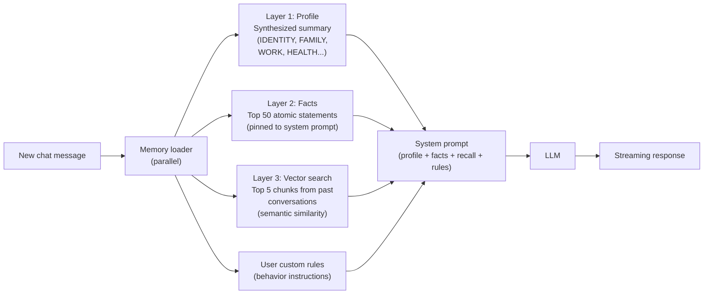
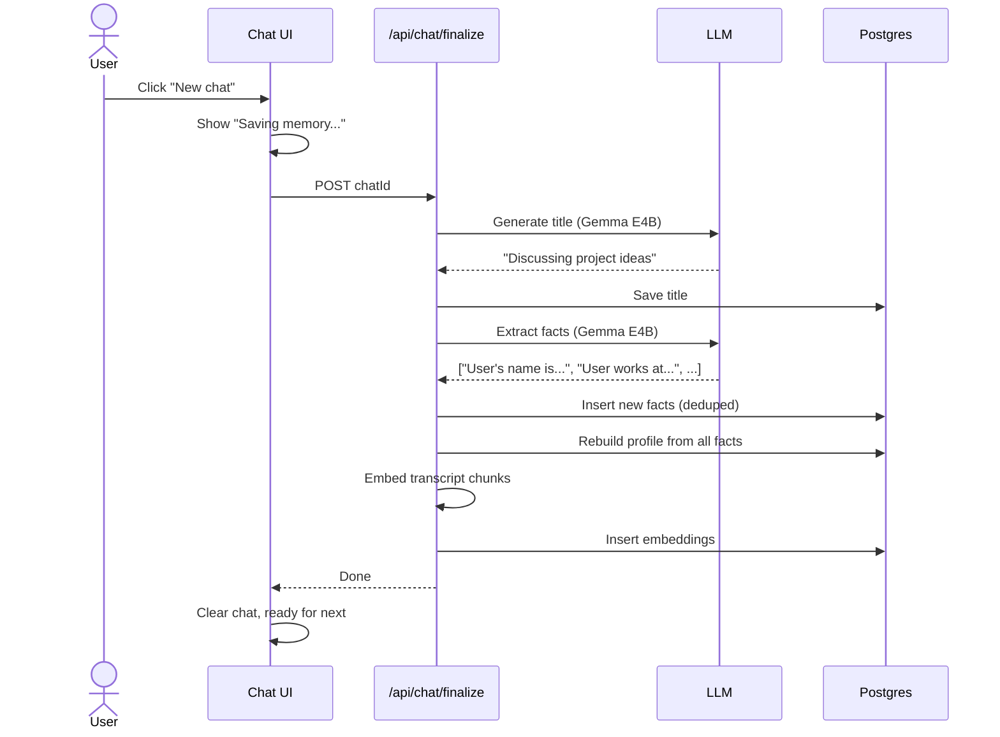

# RecallMEM Architecture

How the deterministic memory framework actually works. If you skimmed the README and want the deep dive on why the LLM is intentionally not in charge of your memory, this is the doc.

## Why this matters

In ChatGPT and Claude.ai with memory turned on, the LLM itself is in charge of your memory. The model decides what to save, the model decides what to recall, the model is the one looking through your history. The problem: LLMs hallucinate. They forget. They retrieve the wrong thing on a bad run. You're trusting the model to remember accurately, and that's exactly the thing models are bad at.

RecallMEM does it backwards. **The chat LLM never touches your memory database.** Not for reads, not for writes. The LLM only ever sees a system prompt that's already been assembled by deterministic TypeScript and SQL.

## System architecture

Everything in green runs on your machine. The dashed cloud box only activates if you explicitly add a cloud provider in settings. Otherwise, nothing leaves your computer. Ever.

## The three-layer memory system

Each layer does a different job:

- **Profile** loads instantly. It's the "who am I talking to" baseline. One database row, always loaded into every system prompt.
- **Facts** are atomic statements you can view, edit, and delete. Stored as individual rows. Pinned into the prompt every conversation.
- **Vector search** finds semantically relevant prose from any past conversation. Catches the stuff that doesn't fit cleanly into facts, like that idea you were working through three weeks ago.

Together, they let the AI know your name, your family, your job, AND remember the specific thing you mentioned a month ago when it becomes relevant.

## The READ path (100% deterministic)

When you send a message:

1. Plain SQL `SELECT` pulls your profile from `s2m_user_profiles`
2. Plain SQL `SELECT` pulls your top *active* facts from `s2m_user_facts` (retired facts are excluded automatically)
3. Each fact is stamped with its `valid_from` date so the model can reason about timelines
4. EmbeddingGemma converts your message to a 768-dim vector (math, not generation)
5. pgvector cosine similarity search ranks chunks from past conversations
6. Each retrieved chunk is stamped with its source-chat date (`[from conversation on 2026-03-12]`) so the model can tell history from now
7. If the chat is being resumed after a multi-hour gap, a one-time system marker like `[Conversation resumed 6 days later]` gets injected before the new user turn
8. TypeScript template assembles all of it into a system prompt
9. **Then** the chat LLM gets called, with the assembled context already in its prompt

The chat LLM never queries the database. It can't decide what to retrieve. It can't pick which facts are relevant. It can't hallucinate a memory that doesn't exist, because if it's not in the prompt, it doesn't exist for the model. The retrieval is 100% deterministic SQL + cosine similarity. No LLM tool calls touching your memory store.

## The WRITE path (LLM proposes, TypeScript validates)

After every assistant reply, a small local LLM (Gemma 4 E4B via Ollama) runs in the background to extract candidate facts from the running transcript. This happens fire-and-forget after the stream closes, so you never wait for it. It always uses the local model regardless of which provider the chat itself is using, so cloud users (Claude, GPT) don't get billed per turn for extraction.

The same LLM call also returns the IDs of any **existing** facts the new conversation contradicts. So when you say "I just left Acme to start a new job," the extractor returns the new fact AND flags the old "User works at Acme" fact for retirement. The TypeScript layer flips those rows to `is_active=false` and stamps `valid_to=NOW()`. History is preserved, the active set always reflects current truth.

But here's the key: the LLM only **proposes** facts and supersession decisions. It cannot write to the database. The TypeScript layer is the actual gatekeeper, and it runs every candidate fact through six validation steps before storage:

1. **Quality gate.** Conversations under 100 characters get zero facts extracted. The LLM never even sees them.
2. **JSON parse validation.** If the LLM returns malformed JSON or no array, the entire batch is dropped.
3. **Type validation.** Only strings survive. Objects, numbers, nested arrays, all rejected.
4. **Garbage pattern filtering.** A regex filter catches the most common LLM hallucinations: meta-observations like "user asked about X", AI behavior notes like "AI suggested Y", non-facts like "not mentioned", mood observations like "had a good conversation", and anything under 10 characters.
5. **Deduplication.** Case-insensitive normalized match against the entire facts table. Duplicates get dropped.
6. **Categorization.** The category (Identity, Family, Work, Health, etc.) is decided by **keyword matching in TypeScript**, not by the LLM. The LLM has no say in how facts get organized.

After all six steps, the surviving facts get a plain SQL `INSERT`. And even then, you can edit or delete any fact in the Memory page if you don't agree with it.

## What happens when you end a chat

Click "New chat", wait a few seconds, and the next conversation immediately sees the new memory.

## Why this matters in practice

- **Predictability.** When you mention "my dog" in a chat, RecallMEM **always** retrieves the facts that match "dog" via cosine similarity. ChatGPT retrieves whatever the model decides to retrieve, which can vary run to run.
- **No hallucinated retrieval.** The LLM cannot remember something that isn't actually in your facts table. If it's not in the database, it's not in the prompt.
- **Auditability.** You can look at any chat and trace exactly which facts and chunks were loaded into the system prompt. With ChatGPT, you can't see what the model decided to surface from memory.
- **No prompt injection memory leaks.** The LLM in RecallMEM only sees what the deterministic layer feeds it. It can't query the rest of the database. With ChatGPT, the model has tool access to memory, which means a prompt injection attack could theoretically make it dump memory contents.
- **Your data, your database.** Memory is data you control, not behavior you have to trust the model to do correctly. You can write a script that queries Postgres directly, edit facts manually, run analytics on your own conversations.

This is the actual reason RecallMEM exists. Not "another local chat UI." A memory architecture where the LLM is intentionally not in charge.

## How RecallMEM compares

| | RecallMEM | ChatGPT / Claude.ai | Mem0 |
|---|---|---|---|
| **Runs locally** | ✅ | ❌ | ❌ |
| **Memory retrieval is deterministic (no LLM tool calls)** | ✅ | ❌ | ❌ |
| **Persistent memory across chats** | ✅ | partial | ✅ |
| **Temporal awareness (memories know when they were true)** | ✅ | ❌ | ❌ |
| **Auto-retires stale facts when truth changes** | ✅ | ❌ | ❌ |
| **You can edit / delete memories** | ✅ | partial | ✅ |
| **Vector search over past chats** | ✅ | ❌ | ✅ |
| **Custom rules / behavior** | ✅ | ✅ | ❌ |
| **Bring your own LLM (any provider)** | ✅ | ❌ | ❌ |
| **Use local models (Gemma 4, Llama, etc)** | ✅ | ❌ | ❌ |
| **No account / no signup** | ✅ | ❌ | ❌ |
| **Free** | ✅ | partial | partial |
| **Source available** | ✅ Apache 2.0 | ❌ | partial |
